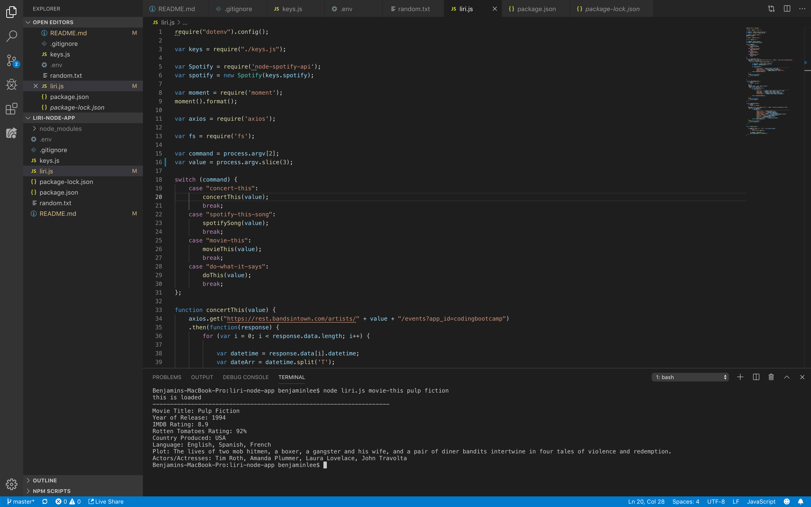
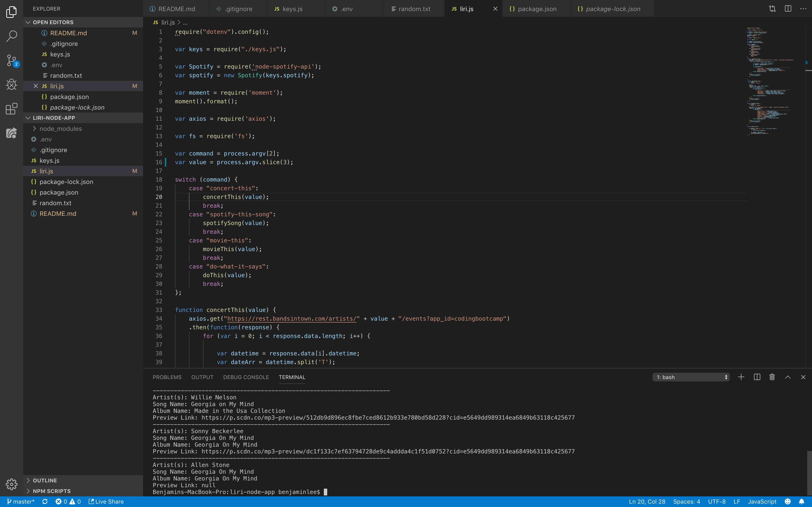

# liri-node-app

A command line node app that utilizes API's from Spotify, OMDB, and Bands in Town.

To use this app:

* Enter into the terminal
* Type "node liri.js" in the command line and use one of the following      commands followed by your query:
    
    * movie-this
    * spotify-this-song
    * concert-this
    * do-what-it-says

